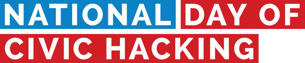

# National Day of Civic Hacking 2016

## June 4th held @ Tech Musem of Innovation
#### [:bulb: City of San Jose Vision Zero: Safer Streets for All! :bulb:](https://docs.google.com/document/d/1Tda2THs0ImpoynC9pLCpUmxicgNlaqdWarWoumsoQnM/edit?usp=sharing)
#### [:bulb: Code for America Challenge: Ready to work En Espanol :bulb:](https://www.codeforamerica.org/events/national-day-2016/challenge-ready-to-work-en-espanol)
#### [:bulb: Code for America Challenge: Digital Service Census :bulb:](https://www.codeforamerica.org/events/national-day-2016/digital-service-census)
#### [:bulb: Browse and Discuss Current Code for San Jose Projects :bulb:](https://github.com/codeforsanjose/Project-Ideas/issues)
#### [:bulb: National Day of Civic Hacking Code of Conduct :bulb:](https://github.com/codeforsanjose/codeofconduct)

## Have a project to Pitch?
1. Create a new Github repo for your project. [need help?](https://help.github.com/articles/create-a-repo/)
2. In your new repo, create a README file explaining the details of your project. Feel free to copy/paste from your project submission. But also try to make it concise. Imagine you are new to the project, what would help you get started? Here are some tips on [what should go on your README](http://atxhack4change.github.io/tech-and-tools/#/3/2).
3. Add Issues to your Github Repo to organize the tasks that your team will need to perform. [Here is some guidance](http://atxhack4change.github.io/tech-and-tools/#/3/4)
4. Use the [Civic Tech Planning Canvas](http://www.open-austin.org/civic-tech-canvas/) to flesh out your idea.
